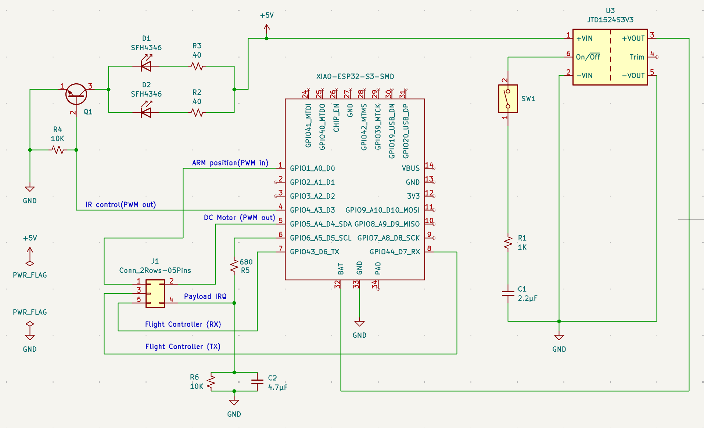
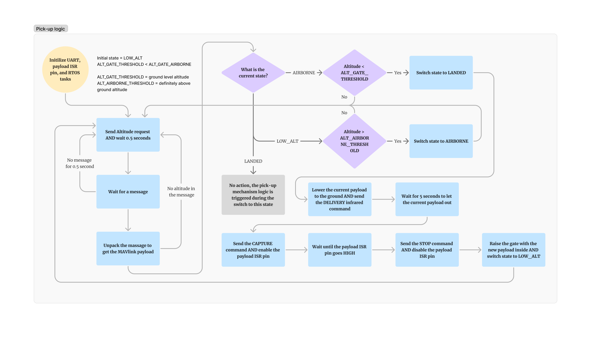

# Brief description:
RTOS based on-board computer attached to the drone in order to efficiently and with high precision communicate with the dynamic payload over the infrared NEC protocol-based transmitter and in order to  manipulate a DC motor with a PWM-based encoder to extend/retract the pick-up mechanism.

## The features supported
1) IR communication to send Capture, Delivery, and Stop to the payload over the NEC protocol
2) ISR that is triggered when the payload enters the pick-up mechanism
3) Encoder-based DC motor controller that reads the position of the continuous control arm to ensure that the extraction/retraction takes the same distance every time.
4) UART connection(no flow control) to a flight controller that reads current relative altitude of the drone. 
5) State machine that enables unlimited amount of missions repeated one after another without ESP32 resets/reboots.

## The PCB schematic

## The logic flow

